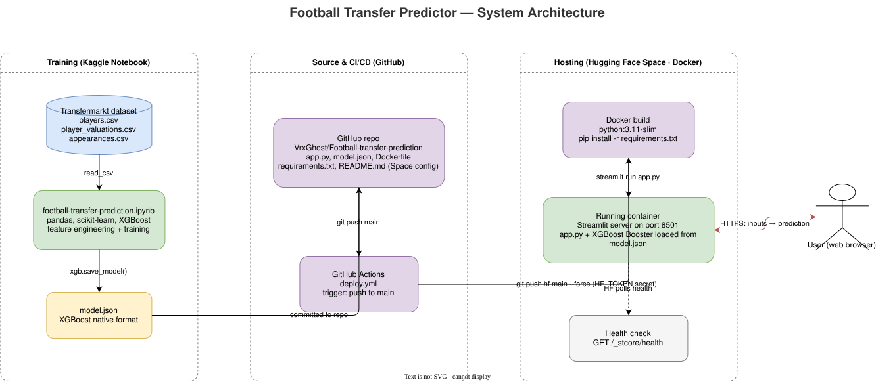
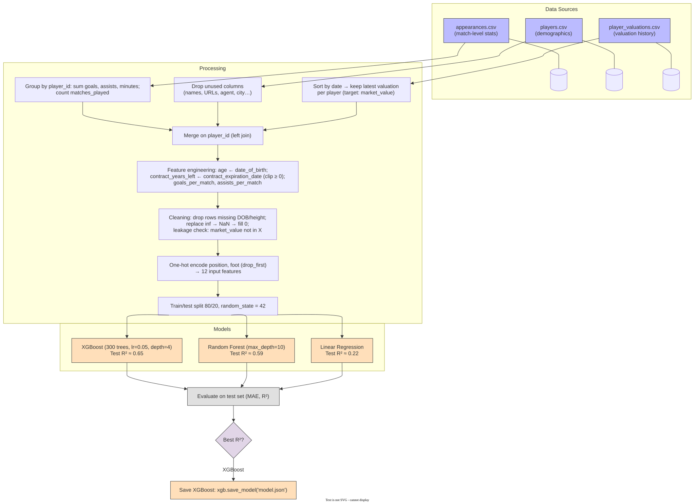
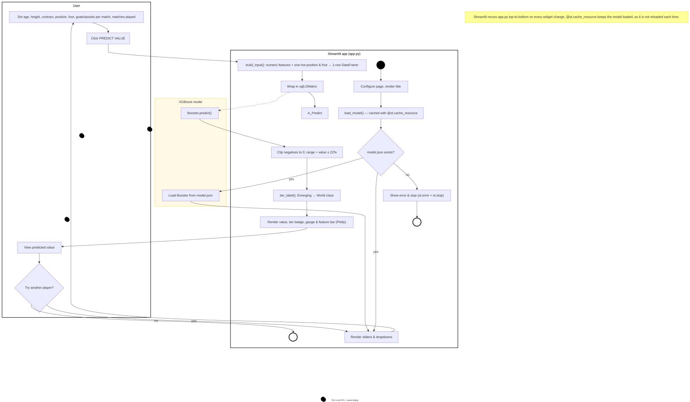
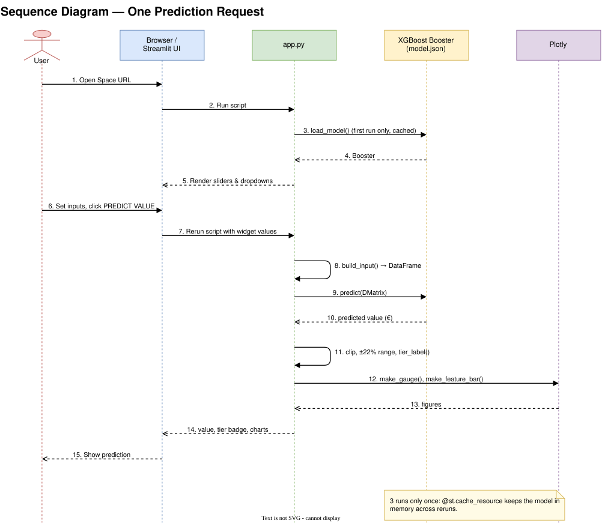

# ⚽ Football Transfer Value Prediction

A machine learning project that predicts football player transfer market values using real Transfermarkt data — deployed as a live web application.

[](https://huggingface.co/spaces/VrxGhost/football-transfer-predictor)
[](https://python.org)
[](https://xgboost.readthedocs.io)
[](https://streamlit.io)

---

## 🎯 Problem Statement

Football clubs spend billions on player transfers every year. Accurately estimating a player's market value helps clubs make smarter decisions. This project builds a regression model that predicts a player's transfer value (in €) based on performance stats, demographics, and contract situation — then serves it as a real-time interactive web app.

---

## 🔴 Live Demo

👉 **[Try it here → huggingface.co/spaces/VrxGhost/football-transfer-predictor](https://huggingface.co/spaces/VrxGhost/football-transfer-predictor)**

Adjust player attributes using the sliders and see the predicted market value update in real-time, including a tier label (Emerging → World Class) and a visual gauge chart.

---

## 🏛️ System Architecture



The model is trained in a Kaggle notebook and saved as `model.json`. Every push to `main` triggers GitHub Actions, which syncs the repo to Hugging Face Spaces. HF builds the Docker image and runs the Streamlit app on port 8501.

---

## 📊 Dataset

**Source:** [Football Data from Transfermarkt](https://www.kaggle.com/datasets/davidcariboo/player-scores) via Kaggle

| File | Contents |
|---|---|
| `players.csv` | Demographics — age, position, height, nationality |
| `player_valuations.csv` | Historical market values per player |
| `appearances.csv` | Match-level stats — goals, assists, minutes |

Dataset size: ~450,000 valuation records across ~31,000 unique players

---

## 🔧 Features Used

| Feature | Description |
|---|---|
| `age` | Player age derived from date of birth |
| `height_in_cm` | Player height |
| `position` | Playing position — one-hot encoded (Attacker / Midfielder / Defender / Goalkeeper) |
| `foot` | Dominant foot — one-hot encoded (Left / Right) |
| `contract_years_left` | Years remaining on current contract |
| `goals_per_match` | Career goals ÷ matches played |
| `assists_per_match` | Career assists ÷ matches played |
| `matches_played` | Total career appearances |

**Target:** `market_value_in_eur` (latest Transfermarkt valuation per player)

---

## 📈 Model Results

| Model | Features | Test R² |
|---|---|---|
| Linear Regression | Age + Height | 0.07 |
| Linear Regression | + Position + Foot | 0.07 |
| Linear Regression | + Contract Years | 0.18 |
| Linear Regression | + Performance Stats | 0.25 |
| Random Forest | All Features | 0.59 |
| **XGBoost** | **All Features** | **0.65** |

XGBoost was selected as the final model. It captures non-linear relationships — for example, young players with high goals-per-match have disproportionately higher market values, which linear models cannot express.

---

## 🏗️ ML Pipeline



```
Data Loading       → players.csv + player_valuations.csv + appearances.csv
Data Merging       → joined on player_id
Feature Engineering→ age, contract_years_left, goals_per_match, assists_per_match
Data Cleaning      → removed leakage, handled missing values
Encoding           → one-hot encode position and foot
Model Training     → LinearRegression → RandomForest → XGBoost
Evaluation         → R² on held-out test set
Serialization      → xgb.save_model("model.json") — native XGBoost format
Deployment         → Streamlit app → Docker → HuggingFace Spaces
CI/CD              → GitHub Actions auto-deploys on push to main
```

---

## ⚙️ How the App Works

**Activity diagram:** what happens from opening the app to seeing a prediction.



**Sequence diagram:** the calls between the browser, `app.py`, the XGBoost model and Plotly for one prediction.



Streamlit reruns `app.py` top to bottom on every widget change. The model is loaded with `@st.cache_resource`, so it is read from disk only once.

---

## 🧠 Key Learnings

**Data leakage** — accidentally including `market_value` as a feature caused R² = 1.0 (perfect, and completely fake). Catching this was the most important debugging moment in the project.

**Feature engineering beats model selection** — adding contract length and performance ratios improved R² from 0.07 → 0.25 before switching models at all.

**Serialization matters** — the original `pickle` format triggered a HuggingFace security warning. Migrated to XGBoost's native `.json` format which is safer, human-readable, and version-stable.

**Overfitting control** — limiting tree depth reduced the train/test R² gap from 0.35 to ~0.16.

---

## 🗂️ Project Structure

```
Football-transfer-prediction/
│
├── app.py                              # Streamlit web application
├── model.json                          # Trained XGBoost model (native format)
├── football-transfer-prediction.ipynb  # Full training notebook
├── requirements.txt                    # Python dependencies
├── Dockerfile                          # Container build for HuggingFace Spaces
├── docs/
│   └── diagrams/                       # Architecture, pipeline, activity & sequence diagrams (.svg)
├── .github/
│   └── workflows/
│       └── deploy.yml                  # CI/CD — auto-deploys to HuggingFace on push
└── README.md
```

---

## 🚀 Run Locally

```bash
git clone https://github.com/VrxGhost/Football-transfer-prediction.git
cd Football-transfer-prediction
pip install -r requirements.txt
streamlit run app.py
```

---

## 🛠️ Tech Stack

| Layer | Tools |
|---|---|
| Language | Python 3.10 |
| ML | XGBoost, scikit-learn, pandas, numpy |
| App | Streamlit, Plotly |
| Deployment | Docker, HuggingFace Spaces |
| CI/CD | GitHub Actions |

---

## 🗺️ Roadmap

- [x] Data pipeline and feature engineering
- [x] Model training and comparison (LR → RF → XGBoost)
- [x] Streamlit app with live prediction
- [x] Docker deployment on HuggingFace Spaces
- [x] Migrate from pickle to XGBoost native format
- [x] GitHub Actions CI/CD pipeline

---

## 👤 Author

**Arya Dutta** — B.Tech Student | Aspiring MLOps Engineer

[](https://www.kaggle.com/code/duttaarya/football-transfer-prediction)
[](https://huggingface.co/VrxGhost)
